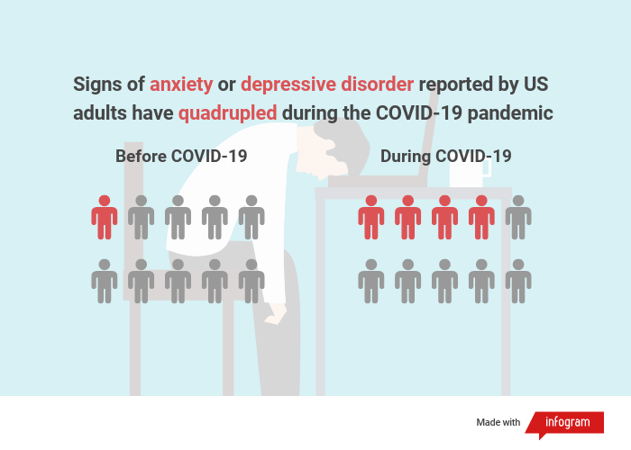

# Part 2
## Wireframing/Storyboards

[Draft Version](https://preview.shorthand.com/rS24U9w0COy35fCO)

## User Research and Interviews
### User research protocol

Are the charts clear and easy to understand?
Is the current story structure logical?
What would you change about the current design?
What additional information would you add?

[Go back to main page](<https://iriswzi.github.io/wanzhiz-portfolio/>)
